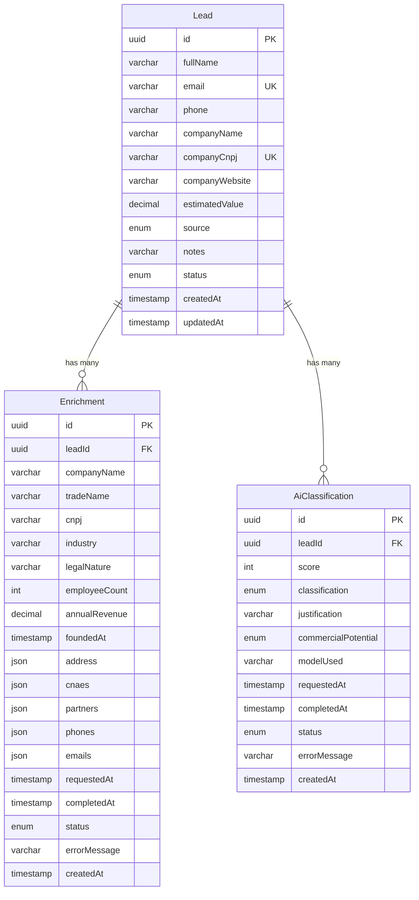

# Lead Management & AI Classification Backend

Sistema backend para gestao de leads comerciais com enriquecimento de dados via API externa, classificacao assistida por IA (Ollama) e processamento assincrono com RabbitMQ.

## Stack

| Camada | Tecnologia |
|---|---|
| Runtime | Node.js 20 |
| Framework | NestJS 11 |
| Linguagem | TypeScript |
| Banco de Dados | PostgreSQL 16 |
| ORM | Prisma 6 |
| Fila | RabbitMQ 3 |
| Testes | Vitest |
| Containerizacao | Docker Compose |
| IA | Ollama (tinyllama) |

## Setup Local

### Pre-requisitos

- Node.js >= 20
- Docker e Docker Compose
- npm

### 1. Clonar e instalar dependencias

```bash
git clone <repo-url>
cd quark-backend_challenge
npm install
```

### 2. Subir infraestrutura

```bash
docker compose up -d
```

Isso inicia: PostgreSQL, RabbitMQ, Ollama (com auto-download do modelo tinyllama) e a Mock API de enriquecimento.

### 3. Rodar migrations e seed

```bash
npx prisma migrate deploy
npx prisma db seed
```

### 4. Iniciar a aplicacao

```bash
npm run start:dev
```

A API estara disponivel em `http://localhost:3000`.

## Comandos

| Comando | Descricao |
|---|---|
| `npm run start:dev` | Inicia em modo desenvolvimento (watch) |
| `npm run build` | Compila para producao |
| `npm run test` | Roda testes unitarios |
| `npm run test:e2e` | Roda testes de integracao |
| `npx prisma migrate dev` | Cria nova migration |
| `npx prisma db seed` | Popula o banco com dados de exemplo |
| `npx prisma studio` | Interface visual para o banco |

## Endpoints

### Leads (CRUD)

| Metodo | Rota | Descricao |
|---|---|---|
| `POST` | `/leads` | Criar lead |
| `GET` | `/leads` | Listar leads (com filtros e paginacao) |
| `GET` | `/leads/:id` | Detalhar lead |
| `PATCH` | `/leads/:id` | Atualizar lead |
| `DELETE` | `/leads/:id` | Remover lead |

### Enriquecimento

| Metodo | Rota | Descricao |
|---|---|---|
| `POST` | `/leads/:id/enrichment` | Solicitar enriquecimento (assincrono) |
| `GET` | `/leads/:id/enrichments` | Historico de enriquecimentos |

### Classificacao

| Metodo | Rota | Descricao |
|---|---|---|
| `POST` | `/leads/:id/classification` | Solicitar classificacao (assincrono) |
| `GET` | `/leads/:id/classifications` | Historico de classificacoes |

### Exportacao

| Metodo | Rota | Descricao |
|---|---|---|
| `GET` | `/leads/export` | Exportar leads consolidados |

#### Filtros disponiveis (GET /leads)

- `status` - Filtrar por status (PENDING, ENRICHING, ENRICHED, CLASSIFYING, CLASSIFIED, FAILED)
- `source` - Filtrar por origem (WEBSITE, REFERRAL, PAID_ADS, ORGANIC, OTHER)
- `search` - Busca por nome, empresa ou email
- `page` - Pagina (default: 1)
- `limit` - Itens por pagina (default: 20)

## Modelagem de Dados



### Maquina de Estados


## Arquitetura

```
src/
  main.ts                         # Bootstrap, pipes, filtros globais
  app.module.ts                   # Modulo raiz
  prisma/                         # PrismaService (global)
  common/
    utils/                        # CNPJ validation, state machine
    validators/                   # Custom class-validator decorators
    filters/                      # Global exception filter
  leads/                          # CRUD module (controller, service, DTOs)
  enrichment/                     # Enrichment module (controller, service, worker)
  classification/                 # Classification module (controller, service, worker)
  queue/                          # RabbitMQ producer (global)
  ai/                             # Ollama HTTP client + prompt engineering
  mock-api-client/                # HTTP client para Mock API
  export/                         # Export module
mock-api/                         # Servico Express standalone (Docker)
prisma/
  schema.prisma                   # Schema do banco
  migrations/                     # Migrations versionadas
  seed.ts                         # Dados de exemplo
```

## Decisoes Tecnicas e Trade-offs

### amqp-connection-manager vs @nestjs/microservices

Optei por `amqp-connection-manager` ao inves do transporte RabbitMQ do NestJS Microservices. O transporte do NestJS e desenhado para RPC (request-response), enquanto nosso caso e puramente fire-and-forget com necessidade de controle fino sobre ack/nack e tratamento de erros por mensagem.

### Tabelas separadas para historico (Enrichment, AiClassification)

Cada execucao de enriquecimento e classificacao cria um novo registro, permitindo auditoria completa, comparacao entre execucoes e rastreamento de evolucao. Campos complexos (address, cnaes, partners) sao armazenados como JSON para flexibilidade, enquanto campos simples sao colunas tipadas para facilitar queries.

### Mock API como servico separado

A API de enriquecimento e um servico Express standalone com seu proprio Dockerfile. Isso simula uma integracao real via HTTP, testando resiliencia do client, timeouts e tratamento de erros de rede. A Mock API gera dados deterministicos baseados no CNPJ (via hash) e simula falhas aleatorias configuravel via `FAILURE_RATE`.

### Ollama com format: 'json'

O parametro `format: 'json'` forca o modelo a retornar JSON valido, reduzindo drasticamente falhas de parsing. Alem disso, o service faz validacao rigorosa dos campos retornados (score 0-100, classification Hot/Warm/Cold, etc.) com fallback para FAILED.

### Prisma 6 vs 7

Optei por Prisma 6 por estabilidade. O Prisma 7 mudou o sistema de geracao de client (ESM-first, output obrigatorio), o que gerava incompatibilidades com o ecossistema NestJS atual. Prisma 6 oferece a mesma funcionalidade com melhor compatibilidade.

### Validacao de CNPJ

Implementacao propria do algoritmo de verificacao de digitos do CNPJ (pesos [5,4,3,2,9,8,7,6,5,4,3,2] e [6,5,4,3,2,9,8,7,6,5,4,3,2]), exposta como custom decorator do class-validator (`@IsCnpj()`). Testada com CNPJs validos e invalidos.

### Campos imutaveis (email, companyCnpj)

O `UpdateLeadDto` usa `OmitType` para remover email e companyCnpj, e `forbidNonWhitelisted: true` no ValidationPipe rejeita com 400 caso o client envie esses campos.
