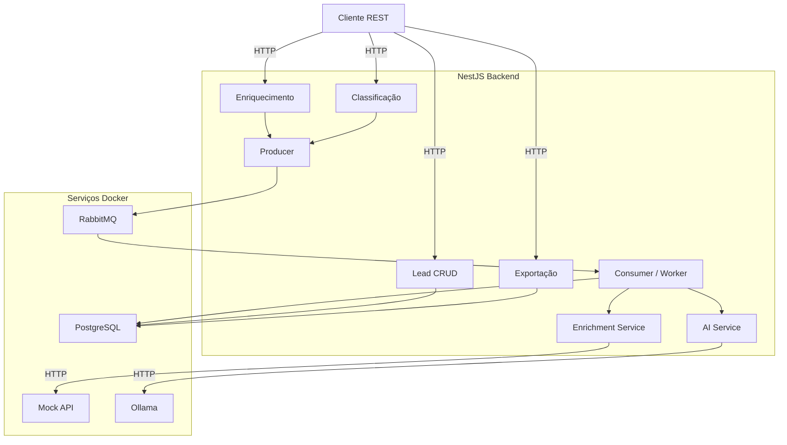
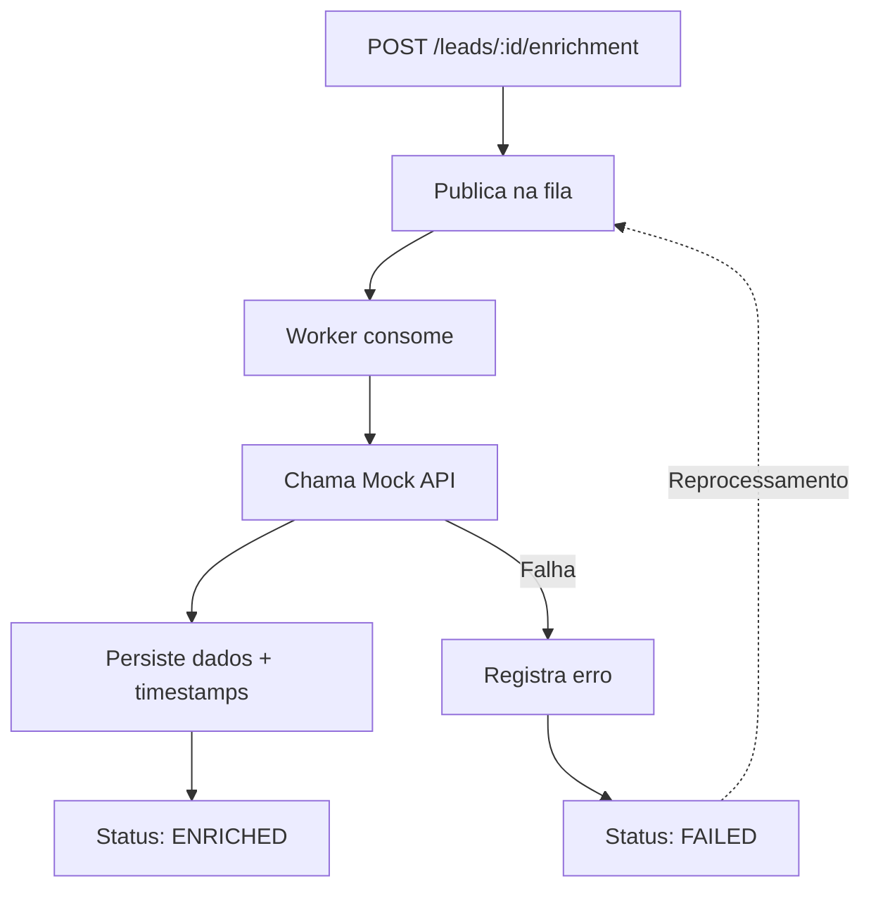
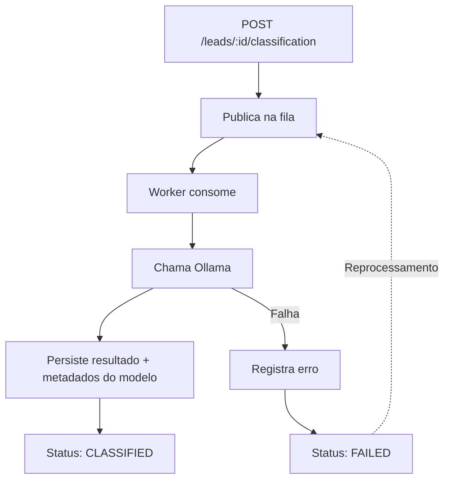
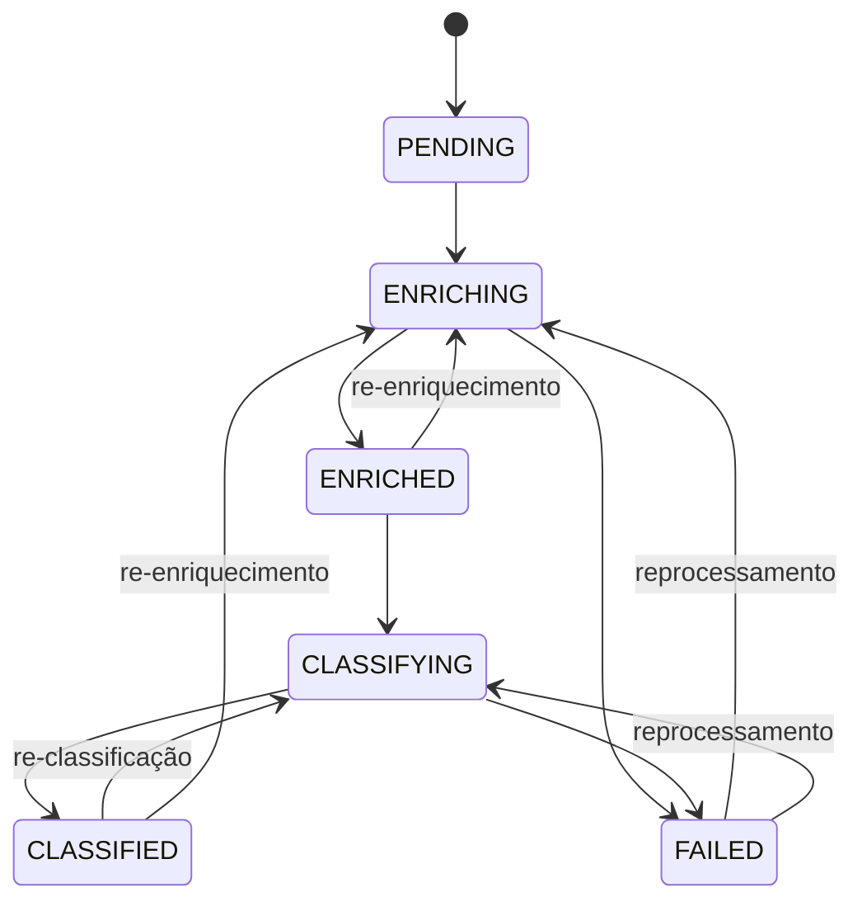

# Backend Challenge — Enriquecimento e Classificação de Leads com IA

## 1. Visão Geral

Construir um sistema backend para gestão de leads comerciais com enriquecimento de dados, classificação assistida por IA e processamento assíncrono.

> **Entrega:** Repositório público no GitHub com instruções claras para execução local.

### Capacidades esperadas

- CRUD completo de leads
- Enriquecimento via API externa mockada
- Classificação via IA local (Ollama)
- Processamento assíncrono com RabbitMQ
- Exportação de dados consolidados
- Histórico completo e auditável de execuções
- Testes automatizados

---

## 2. Stack Obrigatória

| Camada           | Tecnologia              |
|------------------|-------------------------|
| Runtime          | Node.js                 |
| Framework        | NestJS                  |
| Linguagem        | TypeScript              |
| Banco de Dados   | PostgreSQL              |
| ORM              | Prisma                  |
| Fila             | RabbitMQ                |
| Testes           | Vitest                  |
| Containerização  | Docker / Docker Compose |
| Classificação IA | Ollama (Docker)         |

---

## 3. Arquitetura



---

## 4. Fluxos de Processamento

### 4.1 Enriquecimento



### 4.2 Classificação



### 4.3 Máquina de Estados



> Um lead pode ser reprocessado a qualquer momento, gerando sempre um **novo registro** no histórico.

---

## 5. Endpoints

### 5.1 Leads

| Método   | Rota           | Descrição              |
|----------|----------------|------------------------|
| `POST`   | `/leads`       | Criar lead             |
| `GET`    | `/leads`       | Listar leads (filtros) |
| `GET`    | `/leads/:id`   | Detalhar lead          |
| `PATCH`  | `/leads/:id`   | Atualizar lead         |
| `DELETE` | `/leads/:id`   | Remover lead           |

### 5.2 Enriquecimento

| Método | Rota                       | Descrição                              |
|--------|----------------------------|----------------------------------------|
| `POST` | `/leads/:id/enrichment`    | Solicitar enriquecimento (assíncrono)  |
| `GET`  | `/leads/:id/enrichments`   | Consultar histórico de enriquecimentos |

### 5.3 Classificação

| Método | Rota                          | Descrição                             |
|--------|-------------------------------|---------------------------------------|
| `POST` | `/leads/:id/classification`   | Solicitar classificação (assíncrono)  |
| `GET`  | `/leads/:id/classifications`  | Consultar histórico de classificações |

### 5.4 Exportação

| Método | Rota             | Descrição                                          |
|--------|------------------|----------------------------------------------------|
| `GET`  | `/leads/export`  | Exportar leads com enriquecimentos e classificações |

> Formato de exportação e filtros ficam a critério do candidato.

---

## 6. Regras de Negócio

### 6.1 Criação de Lead (`POST /leads`)

| Campo            | Tipo   | Obrigatório | Validações                                                                        |
|------------------|--------|:-----------:|-----------------------------------------------------------------------------------|
| `fullName`       | string | Sim         | Mínimo 3, máximo 100 caracteres                                                  |
| `email`          | string | Sim         | E-mail válido, único no sistema                                                   |
| `phone`          | string | Sim         | Formato E.164 (ex.: `+5511999991111`)                                             |
| `companyName`    | string | Sim         | Mínimo 2, máximo 150 caracteres                                                  |
| `companyCnpj`    | string | Sim         | CNPJ válido (14 dígitos com validação de verificadores), único no sistema         |
| `companyWebsite` | string | Não         | URL válida quando informado                                                       |
| `estimatedValue` | number | Não         | Positivo, até duas casas decimais quando informado                                |
| `source`         | enum   | Sim         | `WEBSITE` · `REFERRAL` · `PAID_ADS` · `ORGANIC` · `OTHER`                        |
| `notes`          | string | Não         | Máximo 500 caracteres quando informado                                            |

### 6.2 Atualização de Lead (`PATCH /leads/:id`)

- Apenas os campos enviados devem ser atualizados.
- As mesmas validações da criação se aplicam.
- **Campos imutáveis após criação:** `email` e `companyCnpj`.

### 6.3 Persistência do Enriquecimento

Cada execução de enriquecimento deve registrar:

| Campo            | Descrição                                        |
|------------------|--------------------------------------------------|
| Dados retornados | Todos os campos da resposta do mock              |
| `requestedAt`    | Data/hora da solicitação                         |
| `completedAt`    | Data/hora da conclusão                           |
| `status`         | `SUCCESS` ou `FAILED`                            |
| `errorMessage`   | Mensagem de erro quando aplicável                |

### 6.4 Persistência da Classificação

Cada execução de classificação deve registrar:

| Campo                  | Descrição                                          |
|------------------------|----------------------------------------------------|
| `score`                | Pontuação numérica (0–100)                        |
| `classification`       | Faixa: `Hot`, `Warm` ou `Cold`                    |
| `justification`        | Justificativa curta                                |
| `commercialPotential`  | `High`, `Medium` ou `Low`                         |
| `modelUsed`            | Nome e versão do modelo (ex.: `tinyllama:latest`) |
| `requestedAt`          | Data/hora da solicitação                          |
| `completedAt`          | Data/hora da conclusão                            |
| `status`               | `SUCCESS` ou `FAILED`                             |
| `errorMessage`         | Mensagem de erro quando aplicável                 |

> O candidato pode combinar regras determinísticas com a saída da IA. A avaliação foca na **qualidade da integração**, não na precisão do modelo.

### 6.5 Histórico

- Cada enriquecimento e classificação gera um registro independente.
- Deve ser possível verificar total de processamentos, comparar execuções, auditar falhas e rastrear evolução de score ao longo do tempo.

---

## 7. API Externa Mockada

A integração de enriquecimento utiliza uma API mockada rodando em Docker.

**Formato esperado da resposta:**

```json
{
  "companyName": "Tech Corp",
  "tradeName": "Tech Corp Soluções",
  "cnpj": "12345678000199",
  "industry": "SaaS",
  "legalNature": "Sociedade Empresária Limitada",
  "employeeCount": 120,
  "annualRevenue": 1500000,
  "foundedAt": "2015-03-10",
  "address": {
    "street": "Rua das Inovações",
    "number": "500",
    "complement": "Sala 42",
    "neighborhood": "Centro",
    "city": "São Paulo",
    "state": "SP",
    "zipCode": "01001-000",
    "country": "BR"
  },
  "cnaes": [
    { "code": "6201-5/00", "description": "Desenvolvimento de programas de computador sob encomenda", "isPrimary": true },
    { "code": "6202-3/00", "description": "Desenvolvimento e licenciamento de programas de computador customizáveis", "isPrimary": false }
  ],
  "partners": [
    {
      "name": "Ana Souza",
      "cpf": "***.456.789-**",
      "role": "Sócia Administradora",
      "joinedAt": "2015-03-10",
      "phone": "+55 11 99999-1111",
      "email": "ana.souza@techcorp.com"
    },
    {
      "name": "Carlos Lima",
      "cpf": "***.654.321-**",
      "role": "Sócio",
      "joinedAt": "2018-07-22",
      "phone": "+55 11 98888-2222",
      "email": "carlos.lima@techcorp.com"
    }
  ],
  "phones": [
    { "type": "commercial", "number": "+55 11 3000-1234" },
    { "type": "mobile", "number": "+55 11 99999-5678" }
  ],
  "emails": [
    { "type": "commercial", "address": "contato@techcorp.com" },
    { "type": "financial", "address": "financeiro@techcorp.com" }
  ]
}
```

> A implementação do mock fica a critério do candidato, desde que suba via `docker compose up`.

---

## 8. Classificação com IA (Ollama)

### Requisitos

- **Ollama** como servidor de inferência, rodando como serviço Docker.
- Modelo pequeno e eficiente: `tinyllama` (~637MB) ou `phi3:mini` (~2.3GB).
- Download do modelo automatizado na inicialização do container.

### Saída esperada

O sistema deve extrair da resposta da IA os campos `score`, `classification`, `justification` e `commercialPotential` conforme descrito na [seção 6.4](#64-persistência-da-classificação).

---

## 9. Processamento Assíncrono

O pipeline deve usar **RabbitMQ** para desacoplar solicitações do processamento.

| Aspecto              | O que avaliamos                              |
|----------------------|----------------------------------------------|
| Enqueue / Dequeue    | Separação limpa entre produtor e consumidor  |
| Reprocessamento      | Re-enfileiramento de leads existentes        |
| Tratamento de falhas | Captura de erros e persistência de status    |
| Idempotência         | Re-execução segura sem corrupção de dados    |
| Consistência         | Status reflete o estágio real do processo     |

---

## 10. Testes

### Unitários

Validar regras de negócio, serviços e funções utilitárias de forma isolada.

### Integração

Validar a interação entre camadas: API → RabbitMQ ��� Worker → Banco de Dados.

Devem cobrir:

- Criação de lead e envio para fila
- Pipeline de enriquecimento e classificação
- Persistência e consulta do histórico
- Cenários de erro e retry

---

## 11. Requisitos de Entrega

O repositório público no GitHub **deve conter**:

1. **Código-fonte** completo — NestJS, TypeScript, Prisma
2. **`docker-compose.yml`** — sobe todo o ambiente com um único `docker compose up`
3. **Migrations e Seeds do Prisma** — versionados no repositório
4. **Testes unitários e de integração** — executáveis via comando documentado
5. **Mock API** — implementação do serviço de enriquecimento
6. **`README.md`** com:
   - Passo a passo para rodar o projeto (do clone ao primeiro request)
   - Comandos para ambiente, migrations, seeds e testes
   - Modelagem de dados adotada (com diagrama)
   - Principais decisões técnicas e trade-offs

---

## 12. Critérios de Avaliação

| Dimensão                     | O que observamos                                     |
|------------------------------|------------------------------------------------------|
| **Arquitetura**              | Separação de responsabilidades, design modular       |
| **Modelagem de dados**       | Schema coerente, suporte a histórico e auditoria     |
| **Processamento assíncrono** | Uso robusto de RabbitMQ com tratamento de falhas     |
| **Integração externa**       | Client HTTP limpo com resiliência a erros            |
| **Uso de IA**                | Integração prática com LLM local, qualidade do prompt|
| **Testes**                   | Cobertura relevante em unitários e integração        |
| **Qualidade de código**      | Legibilidade, convenções, consistência               |
| **Documentação**             | Clareza, completude, facilidade de execução          |
| **Trade-offs**               | Capacidade de explicar decisões e limitações         |

> Não existe uma única solução correta. Valorizamos **clareza de raciocínio, consistência técnica e mentalidade de produção**.
